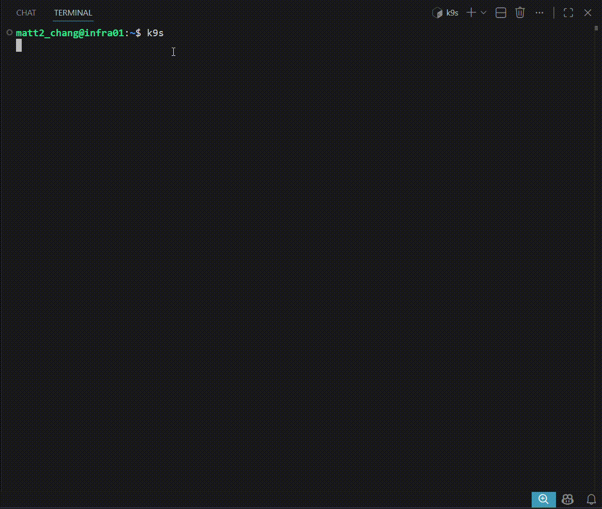
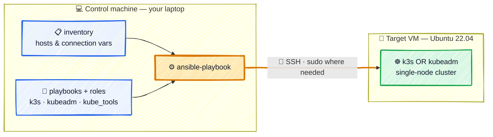
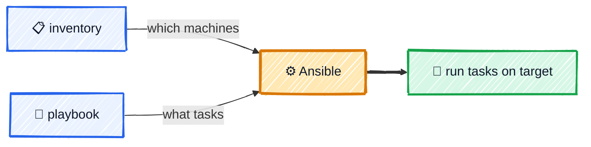

# Ansible in Practice


[](https://github.com/r97221004/ansible-tutorial/actions/workflows/lint.yml)
[](LICENSE)
[](https://github.com/r97221004/ansible-tutorial/stargazers)

> **Problem**: Manually SSH-ing into multiple machines to install packages, copy configs, and start services is slow, repetitive, and easy to get inconsistent.
>
> **Solution**: Ansible lets you describe the desired state of your machines in YAML playbooks and apply them to any number of hosts over SSH — repeatably and idempotently.

A hands-on, example-driven Ansible refresher. Each concept is paired with a runnable playbook, and it all builds toward one concrete outcome: **provisioning a single-node Kubernetes lab (k3s or kubeadm) on a remote VM over SSH** — then tearing it back down, idempotently.



> Best for readers who already know Ansible basics and want a fast, practical refresh (~20–40 min). New to Ansible? Read top to bottom. Just refreshing? Jump straight to the [Table of Contents](#table-of-contents).

## Quick Start

Already have Ansible installed and a reachable Linux VM? Get a Kubernetes node running in four commands:

```bash
# 1. Point the inventory at your VM (edit ansible/inventory/azure.ini)
#    [control]
#    <YOUR_VM_IP> ansible_user=<YOUR_USER> ansible_connection=ssh

# 2. Confirm Ansible can reach it
ansible control -i ansible/inventory/azure.ini -m ping

# 3. Install a single-node k3s cluster
ansible-playbook -i ansible/inventory/azure.ini ansible/playbooks/install_k3s.yml

# 4. Install k9s to inspect the cluster
ansible-playbook -i ansible/inventory/azure.ini ansible/playbooks/install_kube_tools.yml
```

> **Sudo password?** If your target requires a password for `sudo`, add `--ask-become-pass` to steps 3 and 4. Azure VMs and most cloud instances already have passwordless sudo configured, so no extra flag is needed. For managing secrets in a team or CI environment, see [Ansible Vault](#ansible-vault).

Expected tail of the install run:

```
TASK [k3s : Print node status] *************************************************
ok: [<YOUR_VM_IP>] => {
    "msg": ["NAME      STATUS   ROLES                  AGE   VERSION",
            "<vm>      Ready    control-plane,master   30s   v1.x.x+k3s1"]
}

PLAY RECAP *********************************************************************
<YOUR_VM_IP> : ok=8  changed=5  unreachable=0  failed=0
```

Full prerequisites and the SSH setup walk-through are in [Prerequisites](#prerequisites) and [Switch to SSH Connection](#switch-to-ssh-connection).

## Table of Contents

**Getting Started**

- [**What You'll Learn**](#what-youll-learn)
- [**Prerequisites**](#prerequisites)
- [**Architecture Overview**](#architecture-overview)
- [**Repository Map**](#repository-map)

**Part 1 — Fundamentals**

- [**Install Ansible**](#install-ansible)
- [**ansible.cfg**](#ansiblecfg)
- [**Hello World (Local Connection)**](#hello-world-local-connection)
- [**Switch to SSH Connection**](#switch-to-ssh-connection)
- [**Ad-hoc Commands**](#ad-hoc-commands)
- [**Common Modules**](#common-modules)

**Part 2 — Reusable Playbooks**

- [**Idempotency**](#idempotency)
- [**become**](#become)
- [**Variables**](#variables)
- [**when**](#when)
- [**loop**](#loop)
- [**handlers**](#handlers)
- [**tags**](#tags)
- [**Error Handling**](#error-handling)
- [**Ansible Vault**](#ansible-vault)

**Part 3 — Scaling with Roles**

- [**Ansible Roles**](#ansible-roles)
  - [**k3s Role**](#k3s-role)
  - [**kube_tools Role (k9s)**](#kube_tools-role-k9s)
  - [**kubeadm Role**](#kubeadm-role)
- [**Choosing k3s vs kubeadm**](#choosing-k3s-vs-kubeadm)

**Part 4 — Running & Operating**

- [**Testing**](#testing)
- [**Running the Playbooks**](#running-the-playbooks)
- [**Troubleshooting**](#troubleshooting)
- [**FAQ**](#faq)
- [**Next Steps**](#next-steps)
- [**Contributing**](#contributing)

---

## What You'll Learn

- **Drive remote machines over SSH** with ad-hoc commands and playbooks — no manual SSH sessions.
- **Write idempotent tasks** so re-running a playbook is always safe.
- **Parameterize playbooks** with inventory, `group_vars`/`host_vars`, and Ansible Vault for secrets.
- **Control flow** with `when`, `loop`, privilege escalation (`become`), and error handling.
- **Package logic into roles** and use them to install/uninstall a single-node Kubernetes lab (k3s, kubeadm) plus tooling (k9s).

## Prerequisites

- **A control machine** (your laptop) with **Ansible 2.14+** and SSH installed.
- **A target Linux VM** you can reach over SSH — examples use **Ubuntu 22.04** (e.g. an Azure VM).
- **An SSH key pair**, with the public key copied to the target (covered in [Switch to SSH Connection](#switch-to-ssh-connection)).
- **Passwordless sudo** on the target (Azure/cloud VMs default), or a sudo password passed via `--ask-become-pass` or [Ansible Vault](#ansible-vault).
- **Basic comfort** with the Linux shell and YAML.

> Tested with: Ansible 2.14+, Ubuntu 22.04, k3s v1.x, kubeadm/Kubernetes v1.30, k9s latest.

## Architecture Overview



- You run `ansible-playbook` on the **control machine**; no agent is installed on the target — Ansible just needs SSH access.
- Ansible reads the **inventory** (which hosts, how to connect) and the **playbooks + roles** (what to do) independently, then connects over **SSH** and applies the tasks on the **target VM**.
- The same playbook works for one VM or many — you only change the inventory.

## Repository Map

```
ansible/
├── ansible.cfg                 # default inventory + SSH behavior
├── inventory/
│   ├── localhost.ini           # [local] group, runs tasks on your machine
│   ├── azure.ini               # [control]/[node] groups for remote VMs  ← edit this
│   ├── group_vars/control/     # vars.yml (plain) + vault.yml (encrypted)
│   └── host_vars/              # per-host variables
└── playbooks/
    ├── hello.yml               # first playbook (debug output)
    ├── demo_variables.yml      # variables + Vault demo
    ├── install_*.yml           # install entrypoints (k3s, kubeadm, kube_tools)
    ├── uninstall_*.yml         # matching uninstall entrypoints
    └── roles/                  # reusable logic
        ├── k3s/                # lightweight single-node Kubernetes
        ├── kubeadm/            # upstream Kubernetes (containerd + flannel)
        └── kube_tools/         # k9s terminal UI
```

> Start in `inventory/azure.ini` (set your VM), then run a playbook from `playbooks/`.

---

## Install Ansible

```bash
sudo apt update && sudo apt install -y ansible
```

Check the version:

```bash
ansible --version
# ansible [core 2.14+]
```

---

## [ansible.cfg](ansible/ansible.cfg)

Placed in the `ansible/` directory and automatically applied when running `ansible-playbook` from there:

```ini
[defaults]
inventory = inventory/azure.ini   # default inventory, so the -i flag can be omitted
host_key_checking = False         # avoids getting stuck on the host key prompt when SSH-ing into a new machine for the first time
```

> Ansible only auto-loads `ansible.cfg` if you run `ansible-playbook` from the **same directory it's in** (`ansible/`). From the project root, it's ignored, so add `-i ansible/inventory/azure.ini` explicitly.

---

## Hello World (Local Connection)

### Concept



### File Structure

```
ansible/
├── inventory/
│   └── localhost.ini    ← machine list
└── playbooks/
    └── hello.yml        ← task to run
```

### [inventory/localhost.ini](ansible/inventory/localhost.ini)

```ini
[local]
localhost ansible_connection=local
```

- `[local]` → group name
- `localhost` → machine name (itself)
- `ansible_connection=local` → don't use SSH, run directly on the local machine

### [playbooks/hello.yml](ansible/playbooks/hello.yml)

```yaml
---
- name: Hello World
  hosts: all # runs against every host in whichever inventory you pass
  tasks:
    - name: Print message
      ansible.builtin.debug:
        msg: "Ansible is working! This machine is {{ ansible_hostname }}"

    - name: Check OS
      ansible.builtin.debug:
        msg: "OS: {{ ansible_distribution }} {{ ansible_distribution_version }}"
```

- `hosts` → which group to run against (`all` = every host in the inventory you pass)
- `tasks` → list of tasks to execute
- `debug` → module that prints to the screen
- `{{ }}` → variable syntax, automatically gathered by Ansible during the Gathering Facts phase

### Run

```bash
ansible-playbook -i ansible/inventory/localhost.ini ansible/playbooks/hello.yml
```

### Reading the Output

```
TASK [Gathering Facts]   ← automatically gathers machine info (IP, OS, hostname...)
TASK [Print message]     ← ok = success
TASK [Check OS]          ← ok = success

PLAY RECAP
  ok=3      ← all 3 tasks succeeded
  failed=0  ← no failures
```

---

## Switch to SSH Connection

### Concept

In real-world scenarios, Ansible runs commands on remote machines over SSH.

```
laptop (Ansible)  ──SSH──▶  target machine
```

### SSH Key Setup

SSH connections support two authentication methods:

- **Password login**: must enter a password every time
- **SSH key (mainstream)**: copy the public key to the target machine in advance, then no password is needed afterwards

**Generate a key pair**

```bash
ssh-keygen -t ed25519
# press Enter through all prompts
```

This generates two files:

- `~/.ssh/id_ed25519` → private key (stays on your own machine, never share it)
- `~/.ssh/id_ed25519.pub` → public key (copy to the target machine)

> `ed25519` is an encryption algorithm that's shorter, faster, and more secure than the older `rsa`, and is the mainstream choice today.

### Connecting to a Remote Azure VM

**Get the VM's public IP**

On the VM page in the Azure Portal, find the "Public IP address", e.g. `203.0.113.10`.

**Open port 22 (NSG rule)**

Azure blocks external connections by default. You need to add an inbound rule to the VM's "Network Security Group (NSG)"
allowing TCP 22 from your source, otherwise SSH won't be able to connect.

> Security tip: restrict the source to "My IP" — don't open port 22 to `0.0.0.0/0` (the whole world).

**Copy the public key to the Azure VM**

```bash
ssh-copy-id <YOUR_USER>@<YOUR_VM_IP>
# password required the first time (or use the key downloaded when creating the Azure VM), then no password afterwards
```

`ssh-copy-id` automatically writes the public key into the target machine's `~/.ssh/authorized_keys`.

Confirm you can connect:

```bash
ssh <YOUR_USER>@<YOUR_VM_IP>
# connects without a password = success
```

### [inventory/azure.ini](ansible/inventory/azure.ini)

The inventory used for the remote VM:

```ini
[control]
azure-vm ansible_host=<YOUR_VM_IP> ansible_user=<YOUR_USER> ansible_connection=ssh

[node]
```

- `[control]` → the machine that will later become the k3s control node
- `azure-vm` → a logical name for the host (used by `host_vars/azure-vm.yml`)
- `ansible_host=<YOUR_VM_IP>` → the actual IP Ansible connects to
- `ansible_user=<YOUR_USER>` → the login account on the Azure VM
- `[node]` → reserved for worker nodes to be added later (currently empty)

### Run (connecting to the remote VM)

```bash
ansible-playbook -i ansible/inventory/azure.ini ansible/playbooks/hello.yml
```

> From Ansible's perspective, whether connecting locally or to a remote Azure VM, the playbook doesn't need to change at all —
> **just swap the IP and account in the inventory**. This is exactly the value Ansible provides.

> **Targeting specific groups:** this demo uses `hosts: all` so the one file runs against
> whatever inventory you pass. Real playbooks here (k3s, kubeadm) instead target a group —
> e.g. `hosts: control` — so they only touch the intended machines. Once you add workers to
> `[node]`, `all` would hit those too; `control` keeps it to the control node.
> Need more than one group? Combine them with `hosts: control:node`.

---

## Ad-hoc Commands

Quick one-off commands without writing a playbook — useful for checking connectivity or running simple commands across hosts.

### Test connectivity

The first thing to check is whether Ansible can actually reach the host. This runs the `ping` module against every host in the `control` group:

```bash
ansible control -i ansible/inventory/azure.ini -m ping
```

- `ansible` → the ad-hoc command itself — runs a single module without writing a playbook (different from `ansible-playbook`)
- `control` → **who to run against**, not a command — it's a group (or host) name from your inventory. Here it matches the `[control]` group in `azure.ini`; you could just as well use `azure-vm`, `all`, or `control:node`.
- `-i ansible/inventory/azure.ini` → which inventory file to read. Required from the repo root (no `ansible.cfg` there); optional if you run from `ansible/`, where `ansible.cfg` sets a default inventory.
- `-m` → which **module** to run (a module is Ansible's unit of work — `ping`, `copy`, `service`, …; it's the same thing as the module name under `tasks:` in a playbook). `-m ping` confirms SSH login **and** a usable Python on the target — this is **not** an ICMP ping. Omit `-m` and Ansible defaults to the `command` module (used in the next section).

A successful run looks like:

```text
azure-vm | SUCCESS => {
    "changed": false,
    "ping": "pong"
}
```

### Run arbitrary commands

```bash
ansible control -i ansible/inventory/azure.ini -a "uptime"
ansible control -i ansible/inventory/azure.ini -a "df -h" --become
```

- No `-m` here → Ansible falls back to its default, the `command` module, so you don't have to type `-m command`.
- `-a "<command>"` → the **arguments** passed to that module. For the `command` module, the argument is the command line to run on the target (e.g. `uptime`, `df -h`).
- `--become` → run with sudo (same as `become: true` in a playbook)

> Ad-hoc commands are great for quick checks; playbooks are for anything repeatable.

---

## Common Modules

A few modules that show up in almost every playbook.

### command vs shell vs script

| Module    | Description                                                                                        |
| --------- | -------------------------------------------------------------------------------------------------- |
| `command` | runs a command directly, no shell features (no pipes `\|`, `&&`, env vars) — safer, default choice |
| `shell`   | runs through `/bin/sh`, supports pipes/redirects/env vars — use when you need shell features       |
| `script`  | uploads and runs a local script on the remote host                                                 |

```yaml
- name: Safe, no shell features needed
  ansible.builtin.command: k3s kubectl get nodes

- name: Needs a pipe, must use shell
  ansible.builtin.shell: curl -sfL https://get.k3s.io | sh -
```

Unlike `apt` or `file`, `command`/`shell` can't tell whether they actually changed anything, so they **always report `changed`**. Add `changed_when:` to say when a task really counts as a change — use `changed_when: false` for read-only queries so they report `ok` instead of a misleading `changed`:

```yaml
- name: Query node status (read-only, never changes anything)
  ansible.builtin.command: kubectl get nodes
  changed_when: false
```

### apt — package management

```yaml
- name: Install packages
  ansible.builtin.apt:
    name:
      - openssh-server
      - curl
    state: present
    update_cache: true
```

- `state: present` → install if missing (idempotent — does nothing if already installed)
- `update_cache: true` → equivalent to `apt update` before installing

### file — manage files and directories

```yaml
- name: Create a directory
  ansible.builtin.file:
    path: /home/{{ ansible_user }}/.kube
    state: directory
    mode: "0755"

- name: Remove a file
  ansible.builtin.file:
    path: /usr/local/bin/k9s
    state: absent
```

- `state: directory` → create a directory (on the **remote managed host**, not the control node)
- `state: absent` → remove a file or directory
- `mode: "0755"` → set permissions, same as `chmod` (quote it, or YAML may misread the octal)

| mode     | owner | group | other | typical use              |
| -------- | ----- | ----- | ----- | ------------------------ |
| `"0755"` | `rwx` | `r-x` | `r-x` | directories, executables |
| `"0644"` | `rw-` | `r--` | `r--` | regular files            |

### copy vs template

| Module     | Description                                                                                   |
| ---------- | --------------------------------------------------------------------------------------------- |
| `copy`     | copies a file to the target machine — file **content** is sent as-is                          |
| `template` | renders a `.j2` Jinja2 file — file **content** has `{{ variables }}` filled in before copying |

`{{ variables }}` can appear in two different places, and only one of them is affected by which module you use:

1. **Task parameters** (`src`, `dest`, `owner`, `mode`, ...) — always resolved by Ansible, for both `copy` and `template`
2. **File content** (what's inside the file `src` points to) — only resolved for `template`, never for `copy`

**copy — content is fixed, but the destination path can still be dynamic**

```yaml
- name: Copy a static config file into each user's home directory
  ansible.builtin.copy:
    src: files/app.conf
    dest: /home/{{ ansible_user }}/app.conf # task parameter → resolved by Ansible
```

`src` is a file on the control machine, `dest` is the path on the target machine. If `files/app.conf` itself contained the text `{{ ansible_user }}`, it would be copied over literally as `{{ ansible_user }}` — `copy` never touches file content.

**template — both the path and the file content can be dynamic**

**templates/motd.j2**

```
Welcome to {{ ansible_hostname }}
Your IP is {{ ansible_host }}
```

```yaml
- name: Generate motd from template
  ansible.builtin.template:
    src: motd.j2 # on the control machine, under templates/
    dest: /etc/motd # on the target/remote machine
```

Each host ends up with its own `/etc/motd`, e.g. `Welcome to node-a / Your IP is 1.2.3.4` on one host and `Welcome to node-b / Your IP is 5.6.7.8` on another — same template, different output per host.

**remote_src — copy a file that's already on the target machine**

By default `copy`/`unarchive`/etc. expect `src` to be on the control machine. Add `remote_src: true` to instead read `src` from the **target machine itself** — useful for moving/renaming a file that was just downloaded or extracted there.

```yaml
- name: Copy kubeconfig to the user's home directory
  ansible.builtin.copy:
    src: /etc/rancher/k3s/k3s.yaml # already exists on the target machine
    dest: /home/{{ ansible_user }}/.kube/config
    owner: "{{ ansible_user }}"
    mode: "0600"
    remote_src: true # read src from the target machine, not the control machine
```

### service / systemd — manage services

The `systemd` module is Ansible's equivalent of running `systemctl` commands. There's also an older, more generic `service` module (works across systemd/upstart/sysvinit), but on modern Linux `systemd` offers more features.

```yaml
- name: Ensure k3s is running and enabled on boot
  ansible.builtin.systemd:
    name: k3s
    state: started
    enabled: true
```

- `name: k3s` → which service to manage, equivalent to `systemctl status k3s`
- `state: started` → make sure the service is running now
  - already running → does nothing (idempotent)
  - not running → runs `systemctl start k3s`
  - other values: `stopped`, `restarted`, `reloaded`
- `enabled: true` → make sure it starts on boot, equivalent to `systemctl enable k3s` (`false` → `systemctl disable`)

This single task does two things at once — start it now, and make sure it auto-starts on boot — and produces the same result no matter how many times it runs.

---

## Idempotency

Idempotency means: running the same playbook multiple times always produces the same result. The first run makes the necessary changes; every run after that does nothing, because the system is already in the desired state.

This is one of the biggest differences between Ansible and a plain shell script — a shell script that does `apt install` and `mkdir` will error or duplicate work if run twice, but an idempotent playbook can be run as many times as needed without side effects.

### changed vs ok

When you run a playbook, each task reports one of:

- `changed` → the task made a change (first run)
- `ok` → the task checked the current state and found nothing to do (later runs)

```bash
PLAY RECAP *********************************************************
control : ok=5  changed=2  unreachable=0  failed=0
```

For example, an `apt` task installing `curl`:

- 1st run → package not present → installs it → `changed`
- 2nd run → package already present → does nothing → `ok`

The same applies to `file` (directory already exists), `systemd` (service already started/enabled), `template`/`copy` (destination file already matches), etc.

### command / shell are not idempotent by default

`command` and `shell` just run a command — Ansible has no way to know whether it "already happened", so they report `changed` and re-run **every time**.

```yaml
- name: Always runs, always shows changed
  ansible.builtin.shell: curl -sfL https://get.k3s.io | sh -
```

To make a `shell`/`command` task idempotent, add a `creates:` (or `removes:`) argument — Ansible skips the task if that path already exists:

```yaml
- name: Only runs if k3s isn't installed yet
  ansible.builtin.shell: curl -sfL https://get.k3s.io | sh -
  args:
    creates: /usr/local/bin/k3s
```

---

## become

Many tasks (installing packages, managing services, writing to system paths) require root privileges. `become: true` tells Ansible to run with sudo.

### Play-level vs task-level

```yaml
- name: Install k3s
  hosts: control
  become: true # applies to every task in this play
  tasks:
    - name: Download and run install script
      ansible.builtin.shell: curl -sfL https://get.k3s.io | sh -
```

- `become: true` at the **play level** → every task runs with sudo
- `become: true` at the **task level** → only that one task runs with sudo

```yaml
tasks:
  - name: Read a normal file
    ansible.builtin.command: cat /etc/hostname

  - name: Read a root-only file
    ansible.builtin.command: cat /etc/shadow
    become: true # only this task uses sudo
```

### become_user and the ad-hoc equivalent

- `become_user: someuser` → become a specific user instead of root (default is root)
- ad-hoc equivalent: add `--become` (or `-b`) to the command

### Avoiding password prompts

`become: true` only works without prompting if the SSH login user has passwordless sudo, or `ansible_become_pass` is configured.

- **Passwordless sudo (recommended)** — set up on the **target machine** itself, independent of Ansible:

  ```bash
  echo "<YOUR_USER> ALL=(ALL) NOPASSWD:ALL" | sudo tee /etc/sudoers.d/<YOUR_USER>
  ```

  Cloud VM default users (e.g. on Azure) usually already have this configured — that's why `become: true` works without any password prompt in this project.

- **`ansible_become_pass`** — only needed if sudo still requires a password:
  - in inventory (avoid plain text passwords): `ansible_become_pass=xxxx` per host
  - at runtime: `ansible-playbook ... --ask-become-pass` (or `-K`), prompts interactively
  - encrypted with Ansible Vault in group_vars/host_vars (advanced topic)

---

## Variables

Variables avoid hardcoding values (package names, paths, versions...) so the same playbook can behave differently per host or environment.

- **Usage**: reference with `{{ variable_name }}` in task parameters

### inventory — tied to a host

Defined directly on the host line as `key=value`, only applies to that host:

```ini
[control]
azure-vm ansible_host=<YOUR_VM_IP> ansible_user=<YOUR_USER> ansible_connection=ssh
```

`ansible_host`, `ansible_user` and `ansible_connection` are variables that tell Ansible which user and connection method to use for this host.

### playbook `vars:` — only valid within this playbook

```yaml
- name: Install packages
  hosts: control
  vars:
    packages:
      - curl
      - git
  tasks:
    - name: Install packages from a variable
      ansible.builtin.apt:
        name: "{{ packages }}"
        state: present
```

Good for variables that belong to this one playbook and don't need to be shared elsewhere.

### group_vars / host_vars — managed separately from inventory

When there are many variables, move them out of the inventory file into their own files:

- `group_vars/<group>.yml` → applies to every host in that group
- `host_vars/<host>.yml` → applies only to that host

Ansible looks for these directories **next to the inventory file**:

```
ansible/
├── ansible.cfg
└── inventory/
    ├── azure.ini
    ├── group_vars/
    │   └── control/
    │       ├── vars.yml
    │       └── vault.yml
    └── host_vars/
        └── azure-vm.yml
```

```yaml
# inventory/group_vars/control/vars.yml
demo_packages:
  - curl
  - git
```

```yaml
# inventory/host_vars/azure-vm.yml
demo_motd_message: "Welcome to the control node"
```

The filename (or directory name) must match the group name from the inventory (e.g. `control`) or the host (IP/hostname).

|                                                   | matches by               | scope                               |
| ------------------------------------------------- | ------------------------ | ----------------------------------- |
| `group_vars/<group>.yml` or `group_vars/<group>/` | inventory **group name** | every host in that group            |
| `host_vars/<host>.yml`                            | inventory **host name**  | only that host, regardless of group |

> `group_vars/<group>/` can be a **directory** instead of a single file — every `.yml` file inside it is loaded and merged. This is the standard way to keep plaintext variables (`vars.yml`) and [Vault-encrypted](#ansible-vault) variables (`vault.yml`) side by side.

> Since `group_vars`/`host_vars` are tied to the **inventory**, their variables are loaded for _every_ playbook run with that inventory — not just one. Prefix variable names (e.g. `demo_packages`, `demo_motd_message`) to avoid collisions with variables used by other playbooks.

### [playbooks/demo_variables.yml](ansible/playbooks/demo_variables.yml) — putting it together

```yaml
---
- name: Demonstrate variables
  hosts: control
  become: true
  tasks:
    - name: Install packages from group_vars
      ansible.builtin.apt:
        name: "{{ demo_packages }}"
        state: present
        update_cache: true

    - name: Show host_vars message
      ansible.builtin.debug:
        msg: "{{ demo_motd_message }}"
```

```bash
ansible-playbook -i ansible/inventory/azure.ini ansible/playbooks/demo_variables.yml
```

- `demo_packages` comes from `inventory/group_vars/control/vars.yml` → installs `curl` and `git`
- `demo_motd_message` comes from `inventory/host_vars/azure-vm.yml` → printed via `debug`

### command line `-e` — override at run time

```bash
ansible-playbook -i ansible/inventory/azure.ini ansible/playbooks/install_k3s.yml -e "k3s_version=v1.29.0"
```

No file changes needed — useful for one-off tests or temporary overrides.

### Precedence

If the same variable is defined in multiple places, Ansible uses the one with the highest precedence (low → high, for the cases above):

`group_vars` < `host_vars` < playbook `vars:` < command line `-e`

For example, if `packages` is `[curl, git]` in `group_vars/control/vars.yml`, but the playbook is run with `-e '{"packages": ["curl"]}'`, only `curl` gets installed — the `-e` value wins.

---

## when

- **Basic syntax**: `when:` is followed by a condition expression — **no** `{{ }}` needed (unlike other parameters)

```yaml
- name: Only on Debian-based systems
  ansible.builtin.apt:
    name: curl
    state: present
  when: ansible_os_family == "Debian"
```

### Common patterns

- **Based on a variable**: `when: demo_packages | length > 0`
- **Based on facts**: `when: ansible_os_family == "Debian"` (`ansible_os_family` comes from `ansible_facts`)
- **Based on a previous task's result**: use `register` to capture the result, then `when` to check it

```yaml
- name: Check if k3s is already installed
  ansible.builtin.stat:
    path: /usr/local/bin/k3s
  register: k3s_binary

- name: Install k3s
  ansible.builtin.shell: curl -sfL https://get.k3s.io | sh -
  when: not k3s_binary.stat.exists
```

> Similar in effect to the `creates:` argument mentioned in [Idempotency](#idempotency), but `register` + `when` is more flexible — it can check any condition, not just whether a file exists.

---

## loop

- **Basic syntax**: `loop:` takes a list, and `{{ item }}` refers to the current value inside the task

```yaml
- name: Create multiple directories
  ansible.builtin.file:
    path: "/home/{{ ansible_user }}/{{ item }}"
    state: directory
  loop:
    - .kube
    - .ssh
```

- **vs. `apt: name: [...]`**:
  - Package modules like `apt`/`yum` already accept a list directly — no `loop` needed
  - `loop` is for modules whose parameters **don't** accept a list, e.g. `file`, `copy`, `user` — each item runs as its own task

- **`with_items` (old syntax)**: works similarly to `loop`, but is the older form — new playbooks should use `loop`

---

## handlers

When a config file changes, the service that reads it should restart — but only if the file actually changed, and only once even if multiple tasks modify the config. Handlers solve this.

- A task declares `notify: <handler name>` when it makes a change
- Ansible queues the handler but does not run it immediately
- After all tasks in the play finish, each notified handler runs exactly once

```yaml
tasks:
  - name: Configure containerd to use the systemd cgroup driver
    ansible.builtin.lineinfile:
      path: /etc/containerd/config.toml
      regexp: "SystemdCgroup = false"
      line: "            SystemdCgroup = true"
    notify: Restart containerd # queued only if this task reports changed

handlers:
  - name: Restart containerd
    ansible.builtin.systemd:
      name: containerd
      state: restarted
```

- **Deferred** — the handler runs after all tasks, not at the `notify` line; this prevents unnecessary mid-play restarts
- **Deduplicated** — if ten tasks notify the same handler, it still runs only once
- **Conditional** — if the notifying task reports `ok` (nothing changed), the handler is never queued; no change, no restart
- **Ordered** — multiple handlers run in declaration order, not the order they were notified

> The kubeadm role uses this pattern in practice: `containerd.yml` notifies `restart containerd` from `handlers/main.yml` — see [kubeadm Role](#kubeadm-role).

To force handlers to run mid-play instead of waiting until the end:

```yaml
- meta: flush_handlers
```

---

## tags

Tags let you run a subset of tasks from a playbook without modifying it or creating a separate playbook. The examples below are illustrative — the playbooks in this repo don't define tags.

```yaml
tasks:
  - name: Install kubelet kubeadm kubectl
    ansible.builtin.apt:
      name: [kubelet, kubeadm, kubectl]
      state: present
    tags: install

  - name: Query node status
    ansible.builtin.command: kubectl get nodes
    changed_when: false
    tags: verify
```

```bash
# Run only tasks tagged "verify"
ansible-playbook <your-playbook>.yml --tags verify

# Run everything except "verify"
ansible-playbook <your-playbook>.yml --skip-tags verify

# List all available tags without running anything
ansible-playbook <your-playbook>.yml --list-tags
```

- A task can carry **multiple tags**: `tags: [install, k8s]`; `--tags "install,verify"` runs tasks matching either
- `always` is a reserved tag — those tasks run on every invocation unless explicitly excluded with `--skip-tags always`
- Tags also apply to roles: `roles: - { role: k3s, tags: k3s }`

---

## Error Handling

By default, if a task fails, Ansible stops the play on that host. These directives let you control that behavior.

### ignore_errors

- **`ignore_errors: true`** → lets the task fail without stopping the play; Ansible still reports it as `failed`, but moves on to the next task

```yaml
- name: Update apt cache (repo may be temporarily broken)
  ansible.builtin.apt:
    update_cache: true
  ignore_errors: true
```

### failed_when

- **`failed_when:`** → overrides what counts as "failed". By default `command`/`shell` only fail on a non-zero exit code; `failed_when` lets you fail based on the output instead

```yaml
- name: Check root disk usage
  ansible.builtin.command: df -h /
  register: disk_usage
  failed_when: "'100%' in disk_usage.stdout"
```

- the command itself exits `0` (success), but the task is still marked `failed` if `100%` appears in the output

### block / rescue / always

- **`block:`** groups tasks together; **`rescue:`** runs only if a task in the block fails; **`always:`** always runs — similar to try/catch/finally

```yaml
tasks:
  - block:
      - name: Run risky script
        ansible.builtin.command: /usr/local/bin/risky-script.sh
    rescue:
      - name: Notify on failure
        ansible.builtin.debug:
          msg: "risky-script.sh failed, continuing anyway"
    always:
      - name: Remove lock file
        ansible.builtin.file:
          path: /tmp/risky.lock
          state: absent
```

---

## Ansible Vault

Encrypts sensitive data (passwords, tokens, private keys) so it can be safely committed to version control.

### Basic commands

| Command                        | Description                              |
| ------------------------------ | ---------------------------------------- |
| `ansible-vault create <file>`  | create a new encrypted file              |
| `ansible-vault edit <file>`    | edit an encrypted file in place          |
| `ansible-vault encrypt <file>` | encrypt an existing plaintext file       |
| `ansible-vault decrypt <file>` | decrypt back to plaintext                |
| `ansible-vault view <file>`    | view contents without decrypting on disk |

### Example

```bash
ansible-vault create inventory/group_vars/control/vault.yml
```

```yaml
# inventory/group_vars/control/vault.yml (encrypted on disk)
ansible_become_pass: supersecret
```

### Running playbooks with Vault

You only need a vault password flag when the run **loads at least one Vault-encrypted file** (e.g. an encrypted `group_vars`/`host_vars` file or one pulled in via `vars_files`). If nothing encrypted is loaded, omit it — passing `--ask-vault-pass` with no encrypted files errors out with `Attempting to decrypt but no vault secrets found`.

- `--ask-vault-pass` → prompt for the vault password interactively
- `--vault-password-file <path>` → read the password from a file (the file itself should not be committed)

```bash
ansible-playbook -i ansible/inventory/azure.ini <your-playbook>.yml --ask-vault-pass
```

---

## Ansible Roles

### Concept

So far, every playbook has put its tasks directly under `tasks:`. That works for a handful of tasks, but doesn't scale — there's no clean place to keep default settings, and no easy way to reuse the same logic across multiple playbooks.

A **Role** solves this: it packages tasks, default variables, and metadata into a self-contained, conventionally-named directory. Ansible automatically finds `tasks/main.yml`, `defaults/main.yml`, etc. inside it — no explicit imports needed. The playbook itself shrinks down to "use this role":

```yaml
- hosts: control
  become: true
  roles:
    - k3s
```

```
ansible/playbooks/
├── install_k3s.yml      ← playbook, just points at a role
├── uninstall_k3s.yml
└── roles/
    └── k3s/
        ├── tasks/
        │   ├── main.yml      ← entry point, dispatches to install.yml / uninstall.yml
        │   ├── install.yml
        │   └── uninstall.yml
        ├── defaults/
        │   └── main.yml      ← default variables (lowest precedence)
        └── meta/
            └── main.yml      ← role metadata (description, dependencies...)
```

> Ansible looks for `roles/` next to the playbook by default, so roles must live under `playbooks/roles/`.

---

### k3s Role

**[roles/k3s/defaults/main.yml](ansible/playbooks/roles/k3s/defaults/main.yml)**

```yaml
---
# Default variables for the k3s role; override in inventory or the playbook

# present = install, absent = uninstall
k3s_state: present

# Which regular user should own kubeconfig (defaults to the connecting ansible_user)
k3s_user: "{{ ansible_user }}"

# k3s official install script source
k3s_install_url: https://get.k3s.io
```

- `k3s_state` → controls which task file `tasks/main.yml` runs (see [Ansible Roles](#ansible-roles))
- `k3s_user` → defaults to `ansible_user` from the inventory, so kubeconfig ends up owned by the right login user
- `k3s_install_url` → k3s's official install script, kept as a variable so it can be overridden (e.g. for a mirror)

**[roles/k3s/tasks/main.yml](ansible/playbooks/roles/k3s/tasks/main.yml)**

```yaml
---
# Dispatch to install or uninstall based on k3s_state; details live in each task file
- name: Install k3s
  ansible.builtin.include_tasks: install.yml
  when: k3s_state == "present"

- name: Uninstall k3s
  ansible.builtin.include_tasks: uninstall.yml
  when: k3s_state == "absent"
```

#### Install — [tasks/install.yml](ansible/playbooks/roles/k3s/tasks/install.yml)

```yaml
---
- name: Download and run the k3s install script
  ansible.builtin.shell: curl -sfL {{ k3s_install_url }} | sh -
  args:
    creates: /usr/local/bin/k3s # skip if the binary already exists (idempotent)

- name: Ensure k3s is running and enabled on boot
  ansible.builtin.systemd:
    name: k3s
    state: started
    enabled: true

- name: Wait for kubeconfig to be generated
  ansible.builtin.wait_for:
    path: /etc/rancher/k3s/k3s.yaml
    state: present
    timeout: 60 # on a fresh install, k3s needs a moment after start to write this file

- name: Query node status
  ansible.builtin.command: k3s kubectl get nodes
  register: k3s_nodes
  changed_when: false # read-only query, never a change

- name: Print node status
  ansible.builtin.debug:
    msg: "{{ k3s_nodes.stdout_lines }}"

- name: Create the .kube directory
  ansible.builtin.file:
    path: "/home/{{ k3s_user }}/.kube"
    state: directory
    owner: "{{ k3s_user }}"
    mode: "0755"

- name: Copy kubeconfig to the regular user
  ansible.builtin.copy:
    src: /etc/rancher/k3s/k3s.yaml
    dest: "/home/{{ k3s_user }}/.kube/config"
    owner: "{{ k3s_user }}"
    mode: "0600" # contains credentials, owner read/write only
    remote_src: true
```

- `creates: /usr/local/bin/k3s` → on re-runs, the install script is skipped entirely
- `wait_for: ... state: present` → on a fresh install, k3s needs a moment after the service starts before it writes `/etc/rancher/k3s/k3s.yaml`; this waits for the file instead of racing it
- `changed_when: false` → this is a read-only query, so it never reports `changed`
- `remote_src: true` → `/etc/rancher/k3s/k3s.yaml` is read from the **target machine**, not the control machine

#### Uninstall — [tasks/uninstall.yml](ansible/playbooks/roles/k3s/tasks/uninstall.yml)

```yaml
---
- name: Run the k3s uninstall script
  ansible.builtin.command: /usr/local/bin/k3s-uninstall.sh
  args:
    removes: /usr/local/bin/k3s # skip if the binary is already gone

- name: Remove k3s config and data directories
  ansible.builtin.file:
    path: "{{ item }}"
    state: absent
  loop:
    - /etc/rancher
    - /var/lib/rancher

- name: Remove kubeconfig
  ansible.builtin.file:
    path: "/home/{{ k3s_user }}/.kube/config"
    state: absent

- name: Confirm the k3s binary is removed
  ansible.builtin.stat:
    path: /usr/local/bin/k3s
  register: k3s_binary

- name: Print the uninstall result
  ansible.builtin.debug:
    msg: "{{ 'k3s uninstalled successfully' if not k3s_binary.stat.exists else 'k3s is still present, uninstall failed' }}"
```

- `removes: /usr/local/bin/k3s` → the opposite of `creates:`; skips the script once k3s is already gone
- `/etc/rancher` / `/var/lib/rancher` → removed again here in case the uninstall script left anything behind
- final `debug` → reports success/failure based on whether the binary is actually gone

#### Run

Same role, two playbooks — only the `roles:` entry differs:

```yaml
# playbooks/install_k3s.yml — k3s_state defaults to "present"
---
- name: Install K3s cluster
  hosts: control
  become: true # install / systemd / reading /etc/rancher all need root
  roles:
    - k3s
```

```yaml
# playbooks/uninstall_k3s.yml — overrides k3s_state to "absent"
---
- name: Uninstall K3s cluster
  hosts: control
  become: true
  roles:
    - role: k3s
      k3s_state: absent
```

```bash
ansible-playbook -i ansible/inventory/azure.ini ansible/playbooks/install_k3s.yml
ansible-playbook -i ansible/inventory/azure.ini ansible/playbooks/uninstall_k3s.yml
```

#### Verify

```bash
k3s --version                # check version
k3s kubectl get nodes         # confirm node status is Ready
k3s kubectl get pods -A       # view pods across all namespaces
sudo systemctl status k3s     # confirm the service is running
```

---

### kube_tools Role (k9s)

**[roles/kube_tools/defaults/main.yml](ansible/playbooks/roles/kube_tools/defaults/main.yml)**

```yaml
---
# Default variables for the kube_tools role; override in inventory or the playbook

# present = install, absent = uninstall
kube_tools_state: present

# k9s version: latest grabs the newest release, or pin one like v0.32.5
k9s_version: latest

# binary install location
k9s_bin_dir: /usr/local/bin

# Build the download URL from the version (latest uses /latest/download, pinned uses /download/<tag>)
k9s_url: >-
  {{
    'https://github.com/derailed/k9s/releases/latest/download/k9s_Linux_amd64.tar.gz'
    if k9s_version == 'latest'
    else 'https://github.com/derailed/k9s/releases/download/' ~ k9s_version ~ '/k9s_Linux_amd64.tar.gz'
  }}
```

- `kube_tools_state` → same present/absent dispatch pattern as the k3s role (see [Ansible Roles](#ansible-roles))
- `k9s_version` → `latest` always grabs the newest release; pinning a version (e.g. `v0.32.5`) keeps installs reproducible
- `k9s_bin_dir` → where the k9s binary gets installed, defaults to `/usr/local/bin` like k3s
- `k9s_url` → a Jinja2 conditional that builds the download URL from `k9s_version` — `latest` and a pinned version use different GitHub Releases paths

**[roles/kube_tools/tasks/main.yml](ansible/playbooks/roles/kube_tools/tasks/main.yml)**

```yaml
---
# Dispatch to install or uninstall based on kube_tools_state
- name: Install kube tools
  ansible.builtin.include_tasks: install.yml
  when: kube_tools_state == "present"

- name: Uninstall kube tools
  ansible.builtin.include_tasks: uninstall.yml
  when: kube_tools_state == "absent"
```

#### Install — [tasks/install.yml](ansible/playbooks/roles/kube_tools/tasks/install.yml)

```yaml
---
- name: Download k9s
  ansible.builtin.get_url:
    url: "{{ k9s_url }}"
    dest: /tmp/k9s.tar.gz
    mode: "0644"
    timeout: 120 # ~40MB file, give it extra time
  register: k9s_download
  retries: 3 # retry up to 3 times on network blips
  delay: 5
  until: k9s_download is succeeded

- name: Extract k9s
  ansible.builtin.unarchive:
    src: /tmp/k9s.tar.gz
    dest: /tmp/
    remote_src: true

- name: Install the k9s binary
  become: true # only writing to /usr/local/bin needs root
  ansible.builtin.copy:
    src: /tmp/k9s
    dest: "{{ k9s_bin_dir }}/k9s"
    mode: "0755"
    remote_src: true

- name: Check the k9s version
  ansible.builtin.command: k9s version
  register: k9s_check
  changed_when: false

- name: Print the k9s version
  ansible.builtin.debug:
    msg: "{{ k9s_check.stdout_lines }}"
```

- `retries` / `delay` / `until` → retries the download up to 3 times, 5 seconds apart, to handle network blips
- `unarchive` → k9s releases ship as a `.tar.gz`; extract to `/tmp/` and pull the binary out
- `become: true` only on the task that installs the k9s binary → task-level become (see [become](#become)): downloading and extracting happen in `/tmp`, only writing to `/usr/local/bin` needs root, so the whole play doesn't need `become: true`
- `changed_when: false` → just a version check, never reports `changed`

#### Uninstall — [tasks/uninstall.yml](ansible/playbooks/roles/kube_tools/tasks/uninstall.yml)

```yaml
---
- name: Remove the k9s binary
  become: true
  ansible.builtin.file:
    path: "{{ k9s_bin_dir }}/k9s"
    state: absent

- name: Confirm the k9s binary is removed
  ansible.builtin.stat:
    path: "{{ k9s_bin_dir }}/k9s"
  register: k9s_binary

- name: Print the uninstall result
  ansible.builtin.debug:
    msg: "{{ 'k9s uninstalled successfully' if not k9s_binary.stat.exists else 'k9s is still present, uninstall failed' }}"
```

- k9s is just a standalone binary — no systemd service, config file, or data directory — so removing it is a single `file: state: absent`; the closing `stat` + `debug` confirms it's gone, mirroring the k3s uninstall

#### Run

```yaml
# playbooks/install_kube_tools.yml — kube_tools_state defaults to "present"
---
- name: Install kube tools
  hosts: control
  roles:
    - kube_tools
```

```yaml
# playbooks/uninstall_kube_tools.yml — overrides kube_tools_state to "absent"
---
- name: Uninstall kube tools
  hosts: control
  roles:
    - role: kube_tools
      kube_tools_state: absent
```

```bash
ansible-playbook -i ansible/inventory/azure.ini ansible/playbooks/install_kube_tools.yml
ansible-playbook -i ansible/inventory/azure.ini ansible/playbooks/uninstall_kube_tools.yml
```

- Unlike the k3s play, there's **no play-level `become: true`** here — only the task that writes `/usr/local/bin/k9s` declares its own `become: true`; everything else runs as the normal user
- `hosts: control` → installs on the control node by default, so you can SSH in and use k9s to inspect the cluster; to run it locally against a remote cluster instead, change to `hosts: local` with a local inventory

#### Verify

```bash
k9s version           # check version
k9s                   # launch the TUI, reads ~/.kube/config (the copy made by the k3s role)
```

Once inside, you'll see nodes, pods, and other resources; press `:q` or `Ctrl-C` to exit.

---

### kubeadm Role

The `kubeadm` role builds an **upstream Kubernetes** single-node control plane — closer to a "real" cluster than k3s, at the cost of more moving parts. Unlike k3s (one install script), kubeadm needs the container runtime, kernel settings, and a CNI wired up by hand, so the role splits the work into a pipeline of task files.

**[roles/kubeadm/tasks/main.yml](ansible/playbooks/roles/kubeadm/tasks/main.yml)** dispatches on state, same pattern as the other roles:

```yaml
---
- name: Install kubeadm cluster
  ansible.builtin.include_tasks: install.yml
  when: kubeadm_state == "present"

- name: Uninstall kubeadm cluster
  ansible.builtin.include_tasks: uninstall.yml
  when: kubeadm_state == "absent"
```

**The install pipeline** — `tasks/install.yml` calls these in order:

```
prerequisites.yml → containerd.yml → init.yml → flannel.yml
```

| Step                | What it does                                                                                                                                          |
| ------------------- | ----------------------------------------------------------------------------------------------------------------------------------------------------- |
| `prerequisites.yml` | Loads kernel modules (`overlay`, `br_netfilter`), sets sysctl, adds the Kubernetes apt repo, installs and version-locks `kubelet`/`kubeadm`/`kubectl` |
| `containerd.yml`    | Installs containerd, switches it to the **systemd cgroup driver** (required by kubelet), restarts it via a handler                                    |
| `init.yml`          | Runs `kubeadm init`, waits for etcd/API server, then copies kubeconfig to the user                                                                    |
| `flannel.yml`       | Deploys the **flannel** CNI so pods can network and the node turns `Ready`                                                                            |

> The order matters: the runtime and kernel settings must exist before `kubeadm init`, and the cluster must be initialized before a CNI can be applied. `import_tasks` (unlike `include_tasks`) is processed **statically at parse time** — Ansible validates the full sequence before running anything and tasks run in a fixed, guaranteed order.

**[tasks/install.yml](ansible/playbooks/roles/kubeadm/tasks/install.yml)**

```yaml
---
- name: Install prerequisites (kernel modules, sysctl, apt repo, packages)
  ansible.builtin.import_tasks: prerequisites.yml

- name: Install and configure containerd
  ansible.builtin.import_tasks: containerd.yml

- name: Initialize the cluster with kubeadm
  ansible.builtin.import_tasks: init.yml

- name: Deploy the flannel CNI
  ansible.builtin.import_tasks: flannel.yml
```

#### [prerequisites.yml](ansible/playbooks/roles/kubeadm/tasks/prerequisites.yml)

```yaml
---
- name: Configure kernel modules to load on boot (overlay, br_netfilter)
  ansible.builtin.copy:
    dest: /etc/modules-load.d/k8s.conf
    content: |
      overlay
      br_netfilter
    mode: "0644"

- name: Load the overlay and br_netfilter kernel modules now
  ansible.builtin.command: modprobe {{ item }}
  loop:
    - overlay
    - br_netfilter
  changed_when: false

- name: Set the sysctl parameters required by Kubernetes
  ansible.builtin.copy:
    dest: /etc/sysctl.d/k8s.conf
    content: |
      net.bridge.bridge-nf-call-iptables = 1
      net.bridge.bridge-nf-call-ip6tables = 1
      net.ipv4.ip_forward = 1
    mode: "0644"
  register: k8s_sysctl

- name: Apply the sysctl settings
  ansible.builtin.command: sysctl --system
  when: k8s_sysctl.changed
  changed_when: true

- name: Update the apt cache
  ansible.builtin.apt:
    update_cache: true
  ignore_errors: true

- name: Install prerequisite packages
  ansible.builtin.apt:
    name:
      - apt-transport-https
      - ca-certificates
      - curl
      - gpg
    state: present

- name: Create the keyrings directory
  ansible.builtin.file:
    path: /etc/apt/keyrings
    state: directory
    mode: "0755"

- name: Download the Kubernetes apt key
  ansible.builtin.shell: |
    curl -fsSL https://pkgs.k8s.io/core:/stable:/v1.30/deb/Release.key | \
    gpg --dearmor -o /etc/apt/keyrings/kubernetes-apt-keyring.gpg
  args:
    creates: /etc/apt/keyrings/kubernetes-apt-keyring.gpg

- name: Add the Kubernetes apt repository
  ansible.builtin.lineinfile:
    path: /etc/apt/sources.list.d/kubernetes.list
    line: "deb [signed-by=/etc/apt/keyrings/kubernetes-apt-keyring.gpg] https://pkgs.k8s.io/core:/stable:/v1.30/deb/ /"
    create: true
    mode: "0644"

- name: Install kubelet kubeadm kubectl
  ansible.builtin.apt:
    name:
      - kubelet
      - kubeadm
      - kubectl
    state: present
    update_cache: true

- name: Hold the versions to prevent automatic upgrades
  ansible.builtin.dpkg_selections:
    name: "{{ item }}"
    selection: hold
  loop:
    - kubelet
    - kubeadm
    - kubectl
```

- `modprobe` with `changed_when: false` — loading a module that's already loaded is a no-op but still exits 0, so Ansible can't detect "change"; mark it explicitly
- `register: k8s_sysctl` + `when: k8s_sysctl.changed` — only re-apply sysctl if the config file was actually written; re-running `sysctl --system` on every play would be noise
- `creates:` on the apt key download — re-running the curl-pipe-gpg command on a key that's already there would error; skip it once the file exists
- `dpkg_selections: selection: hold` — pins the versions so `apt upgrade` won't accidentally upgrade kubelet mid-cluster

#### [containerd.yml](ansible/playbooks/roles/kubeadm/tasks/containerd.yml)

```yaml
---
- name: Install containerd
  ansible.builtin.apt:
    name: containerd
    state: present

- name: Create the containerd config directory
  ansible.builtin.file:
    path: /etc/containerd
    state: directory
    mode: "0755"

- name: Generate the default containerd config
  ansible.builtin.shell: containerd config default > /etc/containerd/config.toml
  args:
    creates: /etc/containerd/config.toml

- name: Configure containerd to use the systemd cgroup driver
  ansible.builtin.lineinfile:
    path: /etc/containerd/config.toml
    regexp: "SystemdCgroup = false"
    line: "            SystemdCgroup = true"
  notify: Restart containerd

- name: Start the containerd service
  ansible.builtin.systemd:
    name: containerd
    state: started
    enabled: true
```

- `notify: Restart containerd` — if `lineinfile` changes the cgroup setting, the handler queues a restart; on re-runs where the line is already correct, the task reports `ok` and the handler is never queued — see [handlers](#handlers)
- `creates: /etc/containerd/config.toml` — only generate the default config once; on re-runs `lineinfile` checks whether the cgroup line is already correct without regenerating the whole file

#### [init.yml](ansible/playbooks/roles/kubeadm/tasks/init.yml)

```yaml
---
- name: Initialize the kubeadm cluster
  ansible.builtin.shell: >
    kubeadm init
    --apiserver-advertise-address={{ ansible_default_ipv4.address }}
    --apiserver-cert-extra-sans={{ ansible_host }}
    --pod-network-cidr=10.244.0.0/16
    --cri-socket=unix:///var/run/containerd/containerd.sock
  args:
    creates: /etc/kubernetes/admin.conf

- name: Wait for etcd to be ready
  ansible.builtin.wait_for:
    host: "{{ ansible_default_ipv4.address }}"
    port: 2379
    delay: 10
    timeout: 120

- name: Wait for the API server to be ready
  ansible.builtin.wait_for:
    host: "{{ ansible_default_ipv4.address }}"
    port: 6443
    delay: 30
    timeout: 180

- name: Create the .kube directory
  ansible.builtin.file:
    path: /home/{{ kubeadm_user }}/.kube
    state: directory
    owner: "{{ kubeadm_user }}"
    mode: "0755"

- name: Copy kubeconfig
  ansible.builtin.copy:
    src: /etc/kubernetes/admin.conf
    dest: /home/{{ kubeadm_user }}/.kube/config
    owner: "{{ kubeadm_user }}"
    mode: "0600"
    remote_src: true
```

- `creates: /etc/kubernetes/admin.conf` — `kubeadm init` on an already-initialized node would error; skip it once the admin config exists
- `wait_for: port: 2379 / 6443` — etcd and the API server take several seconds to come up after init; `flannel.yml` needs the API server reachable before it can `kubectl apply`

#### [flannel.yml](ansible/playbooks/roles/kubeadm/tasks/flannel.yml)

```yaml
---
- name: Download the flannel manifest
  ansible.builtin.get_url:
    url: https://github.com/flannel-io/flannel/releases/latest/download/kube-flannel.yml
    dest: /tmp/kube-flannel.yml
    mode: "0644"

- name: Pin flannel to the chosen network interface
  ansible.builtin.lineinfile:
    path: /tmp/kube-flannel.yml
    insertafter: "- --kube-subnet-mgr"
    regexp: "^\\s*- --iface="
    line: "        - --iface={{ flannel_iface }}"

- name: Deploy flannel
  ansible.builtin.command: kubectl apply -f /tmp/kube-flannel.yml
  environment:
    KUBECONFIG: /etc/kubernetes/admin.conf
  register: flannel_apply
  changed_when: "'created' in flannel_apply.stdout or 'configured' in flannel_apply.stdout"

- name: Query node status
  ansible.builtin.command: kubectl get nodes
  environment:
    KUBECONFIG: /etc/kubernetes/admin.conf
  register: kubeadm_nodes
  changed_when: false

- name: Print node status
  ansible.builtin.debug:
    msg: "{{ kubeadm_nodes.stdout_lines }}"
```

- `lineinfile: regexp: / line:` — idempotent patch: if `--iface=eth0` is already in the manifest it replaces it; if not, it inserts after `--kube-subnet-mgr`; re-running produces the same result
- `environment: KUBECONFIG:` — root doesn't have `~/.kube/config` at this point; setting `KUBECONFIG` inline targets the admin config without permanently copying it

#### Uninstall — [tasks/uninstall.yml](ansible/playbooks/roles/kubeadm/tasks/uninstall.yml)

```yaml
---
- name: Run kubeadm reset
  ansible.builtin.command: kubeadm reset -f --cri-socket=unix:///var/run/containerd/containerd.sock
  args:
    removes: /etc/kubernetes/admin.conf

- name: Remove kubeconfig
  ansible.builtin.file:
    path: /home/{{ kubeadm_user }}/.kube/config
    state: absent

- name: Remove the CNI config
  ansible.builtin.file:
    path: /etc/cni/net.d
    state: absent

- name: Unhold the versions to allow removal
  ansible.builtin.dpkg_selections:
    name: "{{ item }}"
    selection: install
  loop:
    - kubelet
    - kubeadm
    - kubectl

- name: Remove kubelet kubeadm kubectl
  ansible.builtin.apt:
    name:
      - kubelet
      - kubeadm
      - kubectl
    state: absent

- name: Remove the Kubernetes apt repository
  ansible.builtin.file:
    path: /etc/apt/sources.list.d/kubernetes.list
    state: absent

- name: Remove the Kubernetes apt key
  ansible.builtin.file:
    path: /etc/apt/keyrings/kubernetes-apt-keyring.gpg
    state: absent

- name: Confirm the cluster config is removed
  ansible.builtin.stat:
    path: /etc/kubernetes/admin.conf
  register: kubeadm_admin_conf

- name: Print the uninstall result
  ansible.builtin.debug:
    msg: "{{ 'kubeadm uninstalled successfully' if not kubeadm_admin_conf.stat.exists else 'kubeadm is still present, uninstall failed' }}"
```

- `removes: /etc/kubernetes/admin.conf` — `kubeadm reset` on an already-clean node would error; `removes:` skips it if the cluster is already gone
- unhold before removal — `apt remove` fails on held packages; `dpkg_selections: selection: install` releases the hold first
- removes the apt repo and key — so a future `apt update` doesn't try to reach a repo that's no longer needed

**[handlers/main.yml](ansible/playbooks/roles/kubeadm/handlers/main.yml)**

```yaml
---
- name: Restart containerd
  ansible.builtin.systemd:
    name: containerd
    state: restarted

- name: Restart kubelet
  ansible.builtin.systemd:
    name: kubelet
    state: restarted
```

The handler name must exactly match the string passed to `notify:` in the task files. Both handlers run at the end of the play — not at the point where `notify:` appears — and only if their notifying task reported `changed`.

**[roles/kubeadm/defaults/main.yml](ansible/playbooks/roles/kubeadm/defaults/main.yml)**

```yaml
---
# present = install, absent = uninstall
kubeadm_state: present

# Which regular user should own kubeconfig (defaults to the connecting ansible_user)
kubeadm_user: "{{ ansible_user }}"

# Network interface flannel should advertise on
flannel_iface: "eth0"
```

> Like the k3s role, `kubeadm_user` lives in `defaults` rather than being hardcoded — so install and uninstall always target the same user even if you change the connecting account.

#### Run

```yaml
# playbooks/install_kubeadm.yml
---
- name: Install kubeadm cluster
  hosts: control
  become: true
  roles:
    - kubeadm
```

```bash
ansible-playbook -i ansible/inventory/azure.ini ansible/playbooks/install_kubeadm.yml
ansible-playbook -i ansible/inventory/azure.ini ansible/playbooks/uninstall_kubeadm.yml
```

> First-time `kubeadm init` pulls several container images, so the install takes noticeably longer than k3s. Re-runs are idempotent — `creates:` on the `kubeadm init` step skips re-initializing an existing cluster.

#### Verify

The install run already prints node status at the end (the `flannel.yml` step runs `kubectl get nodes`), and the uninstall run prints whether `/etc/kubernetes/admin.conf` is gone — same confidence checks as the k3s role. You can re-check manually any time:

```bash
kubectl get nodes              # node should reach Ready once flannel is up
kubectl get pods -A            # kube-system + flannel pods Running
kubectl cluster-info
```

> A fresh node may show `NotReady` for a few seconds until the flannel pod starts — re-run `kubectl get nodes` and it should flip to `Ready`.

---

## Choosing k3s vs kubeadm

Both roles give you a single-node Kubernetes control plane on the same VM. Pick based on what you're practicing:

|                     | **k3s**                                       | **kubeadm**                                   |
| ------------------- | --------------------------------------------- | --------------------------------------------- |
| **Best for**        | Fast labs, edge/IoT, "just give me a cluster" | Learning how upstream Kubernetes is assembled |
| **Install effort**  | One script, one task file                     | Multi-step pipeline (runtime, CNI, init)      |
| **Components**      | Bundled (containerd, CNI, etc. built in)      | You wire up containerd + flannel yourself     |
| **Startup time**    | Seconds                                       | Minutes (pulls control-plane images)          |
| **Footprint**       | Lightweight (~512MB RAM)                      | Heavier                                       |
| **Closest to prod** | Conformant but opinionated                    | Vanilla upstream Kubernetes                   |

- **Just want a working cluster to run k9s against?** Use **k3s**.
- **Want to understand kubelet, containerd, CNI, and `kubeadm init`?** Use **kubeadm**.
- **`kube_tools` (k9s) works with either** — it just reads `~/.kube/config`, which both roles set up.

> Don't install both on the same node — they fight over ports and the container runtime. Uninstall one before installing the other.

---

## Testing

[Molecule](https://molecule.readthedocs.io/) is used to integration-test Ansible roles. It spins up a real container, runs the role against it, then asserts the expected outcome — catching regressions without touching a real VM.

Currently the **`kube_tools` role** has a molecule test suite under [`roles/kube_tools/molecule/default/`](ansible/playbooks/roles/kube_tools/molecule/default/).

### Prerequisites

Docker must be running. Install the Python dependencies:

```bash
pip install -r requirements.txt
```

### How the test works

Three files drive the lifecycle:

| File | Purpose |
| ---- | ------- |
| [`molecule.yml`](ansible/playbooks/roles/kube_tools/molecule/default/molecule.yml) | Docker driver + Ubuntu 22.04 platform (`geerlingguy/docker-ubuntu2204-ansible`) |
| [`converge.yml`](ansible/playbooks/roles/kube_tools/molecule/default/converge.yml) | Runs the `kube_tools` role against the container |
| [`verify.yml`](ansible/playbooks/roles/kube_tools/molecule/default/verify.yml) | Asserts k9s binary exists at `/usr/local/bin/k9s` and is executable |

### Run

```bash
cd ansible/playbooks/roles/kube_tools

molecule test       # full lifecycle: create → converge → verify → destroy
molecule converge   # run the role only (keeps the container for manual inspection)
molecule verify     # run assertions only (container must already exist)
molecule destroy    # tear down the container
```

> `molecule test` is the standard CI command — it always starts from a clean container and destroys it afterwards. Use `converge` + `verify` separately when iterating locally.

---

## Running the Playbooks

A quick reference for the full lifecycle. All commands assume `ansible/inventory/azure.ini` points at your VM.

### Typical workflow

```bash
# 1. Confirm connectivity
ansible control -i ansible/inventory/azure.ini -m ping

# 2. Install a cluster (pick one)
ansible-playbook -i ansible/inventory/azure.ini ansible/playbooks/install_k3s.yml
# or
ansible-playbook -i ansible/inventory/azure.ini ansible/playbooks/install_kubeadm.yml

# 3. Install tooling
ansible-playbook -i ansible/inventory/azure.ini ansible/playbooks/install_kube_tools.yml

# 4. Tear down when done
ansible-playbook -i ansible/inventory/azure.ini ansible/playbooks/uninstall_k3s.yml
```

> With `ansible.cfg`'s default inventory, you can drop `-i ansible/inventory/azure.ini` **when running from inside the `ansible/` directory**.

### Checking idempotency

The hallmark of a good playbook: run it twice, the second run changes nothing.

```bash
ansible-playbook ansible/playbooks/install_k3s.yml      # first run:  changed=5
ansible-playbook ansible/playbooks/install_k3s.yml      # second run: changed=0
```

Look at the `PLAY RECAP` — a second run should report `changed=0`. Any task still reporting `changed` on every run is a candidate for a `creates:`/`changed_when:` fix (see [Idempotency](#idempotency)).

---

## Troubleshooting

<details>
<summary><strong>SSH: <code>UNREACHABLE</code> / Permission denied (publickey)</strong></summary>

- Confirm you can SSH manually first: `ssh <user>@<ip>`.
- Make sure your public key is on the target: `ssh-copy-id <user>@<ip>`.
- Check the inventory line matches the real user/IP: `ansible_user=<user>`.
- On a brand-new host, `host_key_checking = False` in `ansible.cfg` avoids the fingerprint prompt.
- On Azure, confirm the **NSG inbound rule** allows TCP 22 from your IP.

</details>

<details>
<summary><strong><code>become</code> / sudo password prompts or failures</strong></summary>

- The login user needs **passwordless sudo**, or set `ansible_become_pass` (ideally via Vault).
- Quick test: `ansible control -m command -a "id" --become`.
- Interactive fallback: add `--ask-become-pass` (`-K`) to the command.

</details>

<details>
<summary><strong>"Attempting to decrypt but no vault secrets found"</strong></summary>

- You have a `group_vars/control/vault.yml` that is Ansible Vault-encrypted. Add `--ask-vault-pass` to your command, or remove the file if you no longer need it.
- `vault.yml` is not included in this repo — if you created one locally and forgot the password, delete it and re-create it with `ansible-vault create`.
- View encrypted contents without decrypting on disk: `ansible-vault view inventory/group_vars/control/vault.yml`.

</details>

<details>
<summary><strong>kubeconfig missing / <code>kubectl</code> can't connect</strong></summary>

- k3s writes `/etc/rancher/k3s/k3s.yaml`; the role copies it to `~/.kube/config`. If `kubectl`/`k9s` can't connect, confirm that copy exists and is owned by your user.
- For k3s you can always use the bundled client: `k3s kubectl get nodes`.
- For kubeadm, kubeconfig comes from `/etc/kubernetes/admin.conf`.

</details>

<details>
<summary><strong>Node stuck in <code>NotReady</code></strong></summary>

- This is almost always the CNI. For kubeadm, check the flannel pods: `kubectl get pods -n kube-flannel` (or `kube-system`).
- Give it a few seconds after install and re-check `kubectl get nodes`.
- If you have multiple NICs, set `flannel_iface` to the correct interface.

</details>

---

## FAQ

**Do I need a cloud VM?** No — any reachable Linux host works (a local VM, WSL, a Raspberry Pi). The examples use Azure, but only the inventory IP/user changes.

**Can I run everything locally?** The teaching playbooks (`hello.yml`, `demo_variables.yml`) run against any host. For the Kubernetes roles, use a Linux VM you don't mind wiping.

**Why both k3s and kubeadm?** They teach different things — see [Choosing k3s vs kubeadm](#choosing-k3s-vs-kubeadm).

**Is it safe to re-run a playbook?** Yes, that's the point — they're idempotent. See [Checking idempotency](#checking-idempotency).

**How do I target a different host?** Edit `ansible/inventory/azure.ini` (or pass a different `-i` inventory). No playbook changes needed.

---

## Next Steps

- **Add a worker node**: populate the `[node]` group in the inventory and extend the roles to join workers.
- **Pin versions**: set `k9s_version` / kubeadm Kubernetes version for reproducible builds.
- **Deploy a workload**: `kubectl create deployment web --image=nginx` and explore it in `k9s`.
- **Go multi-host**: point the inventory at several VMs and run the same playbook unchanged.
- **Add molecule tests**: only `kube_tools` has a test suite today — `k3s` and `kubeadm` are good candidates to cover next.

---

## Contributing

Contributions and corrections are welcome.

1. Fork the repo and create a branch: `git checkout -b improve-xyz`.
2. Keep changes focused; match the existing style (English, bold-keyword bullet lists).
3. Run `ansible-lint` from the repo root before opening a PR — it must pass with no failures. Lint rules are configured in [`.ansible-lint`](.ansible-lint) and [`.yamllint`](.yamllint).
4. If you edited the `kube_tools` role, run `molecule test` from `ansible/playbooks/roles/kube_tools/` as well — CI runs both checks on every PR via [`.github/workflows/lint.yml`](.github/workflows/lint.yml).
5. Open a pull request describing what changed and why.

Found a typo or unclear explanation? Open an issue — small fixes help every future reader.
